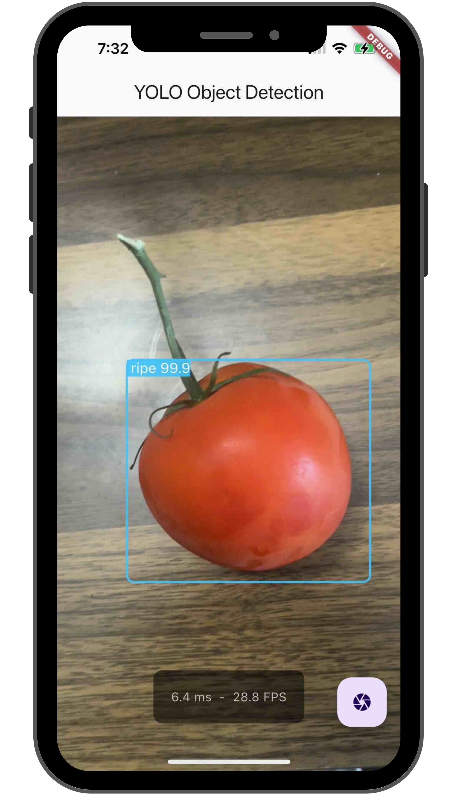

# YOLO Tomato Ripness Detection

Demonstrates how to use the YOLO on [ripe and unripe Tomatoes Dataset dataset](https://www.kaggle.com/datasets/sumn2u/riped-and-unriped-tomato-dataset) for detecting ripness.

  

 

The model used here was exported from the [ripe and unripe tomatoes detection](https://www.kaggle.com/code/sumn2u/yolo-v8-ripe-and-unripe-tomatoes-detection) experiment and annotated using [Annotate Lab](https://github.com/sumn2u/annotate-lab).

## Getting Started

This project is a starting point for a Flutter application.

A few resources to get you started if this is your first Flutter project:

- [Lab: Write your first Flutter app](https://docs.flutter.dev/get-started/codelab)
- [Cookbook: Useful Flutter samples](https://docs.flutter.dev/cookbook)

For help getting started with Flutter development, view the [online documentation](https://docs.flutter.dev/), which offers tutorials, samples, guidance on mobile development, and a full API reference.

